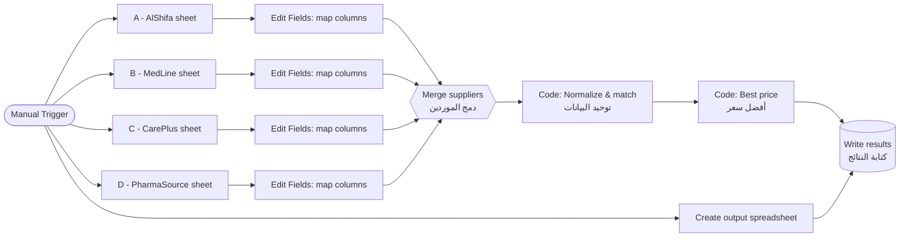

# 💊 Medicine Newsletter — Best Price Finder (n8n)

An [n8n](https://n8n.io) workflow that pulls medicine price lists from **four pharmaceutical suppliers** stored in Google Sheets, normalizes their inconsistent data, matches the same product across suppliers, and writes a **best-price report** to a new, timestamped Google Sheet.

Every supplier names its columns differently, writes doses in different units (`1g`, `1000 mg`, `500mcg`), and describes packs and forms in its own way (`2 x 14`, `BOX 28`, `Tabs`, `Tablet`). This workflow turns all of that into one clean comparison table.

---

## ✨ Features

- **Multi-supplier ingestion** — reads four supplier sheets in parallel (AlShifa, MedLine, CarePlus, PharmaSource).
- **Automatic column mapping** — detects which supplier a row belongs to from its column headers and maps it to a unified schema.
- **Smart normalization**
  - Doses converted to mg (`g`, `mcg`, `µg` supported), including combination strengths such as `875 mg / 125 mg`.
  - Names cleaned of embedded doses and form words (`Brufen 400 Tabs` → `brufen`).
  - Dosage forms unified (`tab`, `tabs`, `tablets` → `tablet`; `evohaler` → `inhaler`, etc.).
  - Pack sizes computed (`2 x 14` → `28`, `20'S` → `20`).
  - Manufacturer names standardized (`G.S.K`, `gsk` → `GSK`).
  - Barcodes validated as EAN‑8 / UPC / EAN‑13 / GTIN‑14; values corrupted by scientific notation (`6.29E+12`) are rejected.
- **Three-level product matching**
  1. Exact **barcode / GTIN / EAN** match — confidence `very-high`
  2. **Barcode inference** from normalized fields when a row has no barcode — confidence `high` / `medium` (missing doses are also inferred)
  3. **Composite key** fallback (name + dose + form + pack + manufacturer) — confidence `normal`
- **Best-price logic**
  - Picks the lowest price **among suppliers that have stock**.
  - Ties go to the supplier with the most stock.
  - Removes duplicates inside the same supplier and flags them.
  - Warns when a cheaper offer exists but is out of stock.
- **Data-quality notes** — invalid prices, invalid barcodes, unknown columns, duplicates and inferred values are reported per product.
- **Timestamped output** — each run creates a fresh spreadsheet named `أفضل أسعار الأدوية YYYY-MM-DD HH:mm`.

---

## 🔄 Workflow Overview



| # | Node | Type | Purpose |
|---|------|------|---------|
| 1 | When clicking ‘Execute workflow’ | Manual Trigger | Starts the run |
| 2 | Create spreadsheet | Google Sheets | Creates the timestamped output file |
| 3 | A / B / C / D supplier nodes | Google Sheets | Read each supplier's price list (unformatted values) |
| 4 | Edit Fields 4–7 | Set | Rename supplier columns to the unified schema |
| 5 | دمج الموردين (Merge suppliers) | Merge (4 inputs) | Combines all supplier rows |
| 6 | توحيد البيانات (Normalize data) | Code | Normalization, validation and cross-supplier matching |
| 7 | أفضل سعر (Best price) | Code | Groups by product and selects the best in-stock offer |
| 8 | كتابة النتائج (Write results) | Google Sheets | Appends the report to the new spreadsheet |

---

## 📥 Input Format

Each supplier sheet keeps its own column names. The workflow maps them as follows:

| Unified field | AlShifa | MedLine | CarePlus | PharmaSource |
|---|---|---|---|---|
| `code` | Item Code | SKU | Code | Product_ID |
| `name` | Product Name | Medicine | Trade Name | Description |
| `dose` | Strength | Dose | Concentration | Power |
| `form` | Dosage Form | Form Type | Form | Dosage |
| `package` | Pack | Package | Pack Size | Box |
| `quantity` | Qty | Stock | Available | On Hand |
| `price` | Price | Unit Price | Cost | Net Cost |
| `brand` | Manufacturer | MFR | Company | Brand Owner |
| `barcode` | Barcode | GTIN | Barcode No | EAN |

> Header matching ignores case, extra spaces and underscores. A row is accepted when at least 7 of the 9 expected columns are found.

---

## 📤 Output Columns

| Column | Description |
|---|---|
| `medicine` | Canonical product label: `Name \| Dose \| Form \| N units \| Manufacturer` |
| `barcode` | Canonical barcode (if known) |
| `name`, `dose`, `form`, `pack_size`, `manufacturer` | Canonical product details |
| `status` | `متوفر` (available) or `غير متوفر لدى أي مورد` (not available at any supplier) |
| `best_price` | Lowest in-stock price |
| `best_supplier` | Supplier(s) offering the best price |
| `best_supplier_sku` | Supplier's own code for the product |
| `best_supplier_stock` | Stock at the best supplier |
| `highest_price_in_stock` | Highest in-stock price across suppliers |
| `saving_vs_highest` | Difference between highest and best price |
| `suppliers_in_stock` | Number of suppliers with stock |
| `total_stock` | Combined stock across suppliers |
| `all_offers` | Every offer, e.g. `MedLine: 12.5 (40) \| CarePlus: 13 (نفد)` |
| `match_method` | How rows were matched (`barcode`, `normalized-fields-to-barcode`, `unique-core-inference`, `composite-key`) |
| `notes` | Data-quality warnings (in Arabic) |

---

## 🚀 Getting Started

### Prerequisites

- An n8n instance (self-hosted or n8n Cloud)
- A Google account with access to the four supplier spreadsheets
- A **Google Sheets OAuth2** credential configured in n8n

### Installation

1. Clone this repository:
   ```bash
   git clone https://github.com/<your-username>/<repo-name>.git
   ```
2. In n8n, go to **Workflows → Import from File** and select `Medicine_Newsletter_Best_Price_.json`.
3. Open each Google Sheets node and select your **Google Sheets OAuth2** credential.
4. Point the four supplier nodes (`A - AlShifa`, `B - MedLine`, `C - CarePlus`, `D - PharmaSource`) to **your own** supplier spreadsheets and sheet tabs.
5. Click **Execute workflow**.
6. Open your Google Drive — a new spreadsheet named `أفضل أسعار الأدوية <date time>` contains the results.

---

## 🛠️ Customization

**Add a new supplier**

1. Add a Google Sheets node for the new supplier and connect it to the trigger.
2. Add an Edit Fields node that maps its columns to the unified schema.
3. Increase the Merge node's **Number of Inputs** and connect the new branch.
4. Add the supplier's column mapping to the `SUPPLIERS` array in the **توحيد البيانات** Code node.

**Add a known manufacturer display name** — extend the `known` object in `displayBrand()`.

**Support a new dosage form** — add a rule to `normalizeForm()`; put specific forms before generic ones.

**Run on a schedule** — replace the Manual Trigger with a **Schedule Trigger** (e.g. every morning) to produce a daily price newsletter.

---

## 🔒 Security Notes

- Credentials are **not** included in the exported JSON; you must create your own in n8n.
- The exported file contains the IDs of the original supplier spreadsheets. Replace them with your own, and consider removing them before publishing the repository publicly.

---

## 🧰 Tech Stack

- **n8n** — workflow automation
- **Google Sheets API** — data source and output
- **JavaScript** (n8n Code nodes) — normalization, matching and pricing logic

---
